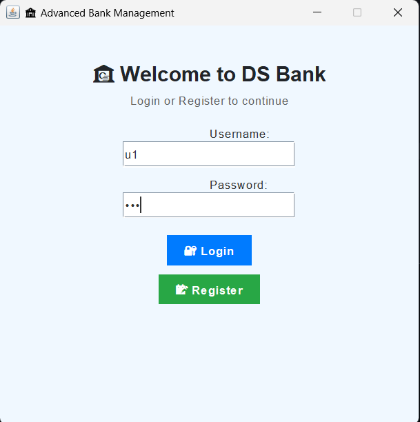
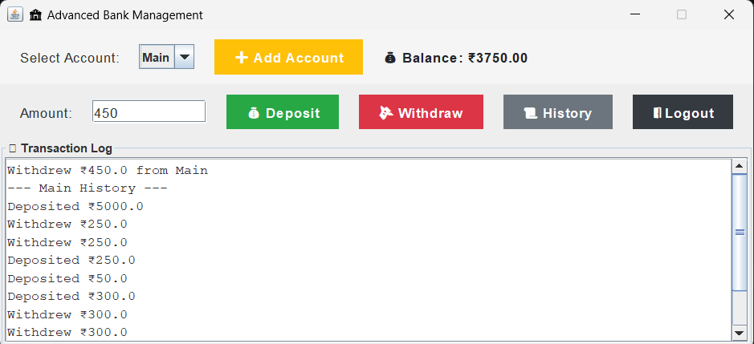
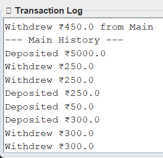

# 🏦 Advanced Bank Management System (Java Swing)

A visually enhanced, user-friendly **Bank Management System** built using **Java Swing**.  
This application allows users to securely register, log in, manage multiple accounts, perform transactions, and view transaction histories — all within a colorful modern GUI.

---

## 🎯 Features

- 🔐 User Registration and Login
- 🏦 Multi-Account Support (per user)
- 💰 Deposit and Withdraw Funds
- 📊 Live Balance Display (updates instantly)
- 📜 Transaction History Log
- 🧾 Scrollable Output Pane
- 🎨 Clean and Colorful UI using Swing
- 💾 Data Persistence

---

## 🖼️ Screenshots

>  >  > 

---

## 🧰 Technologies Used

| Technology    | Purpose                   |
| ------------- | ------------------------- |
| Java (JDK 8+) | Core programming language |
| Swing         | GUI Framework             |
| OOP Concepts  | User and Account handling |
| File I/O      | Data persistence          |

---

## 🚀 Getting Started

### ✅ Prerequisites

- Java JDK 8 or higher
- Any Java IDE (like IntelliJ, Eclipse, VS Code)

### 🔧 Setup Instructions

1. **Clone this repo**

   ```bash
   git clone https://github.com/Devansh-ds/CANTILEVER.git

   ```

2. **Change directory**

   ```bash
   cd bank-management

   ```

3. **compile and run**

   ````bash
   
   javac *.java
   java BankApp

   ````
