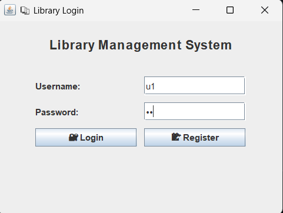
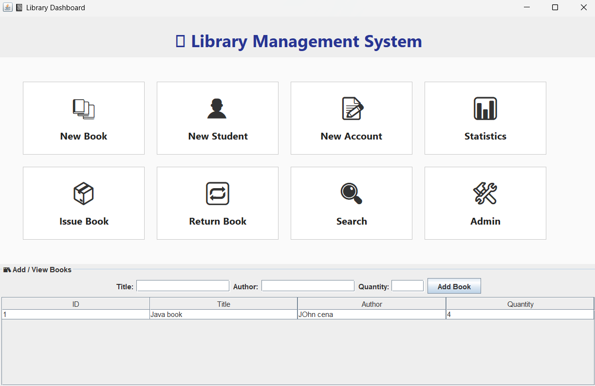
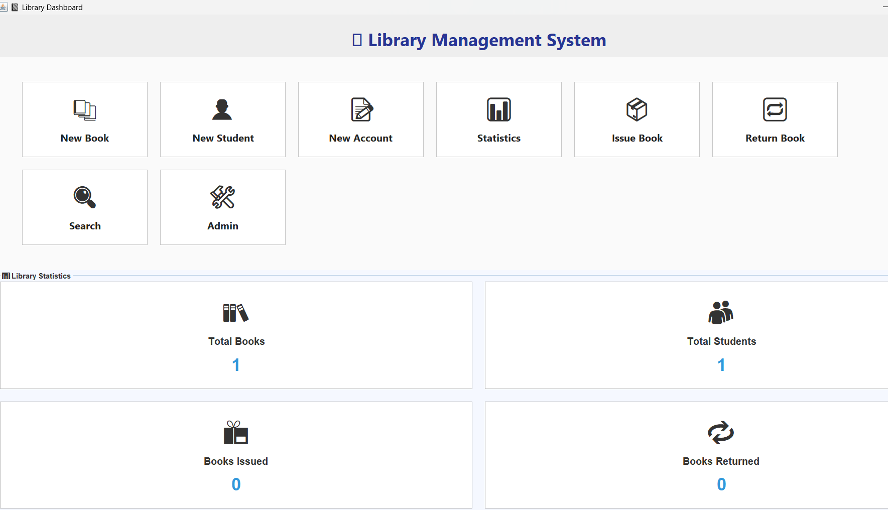
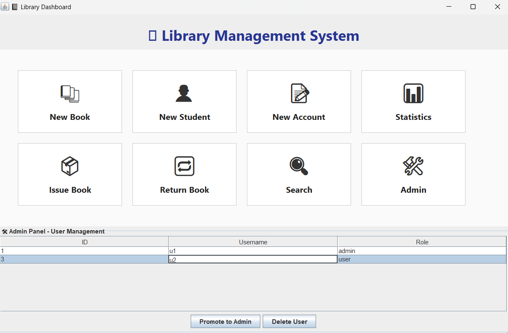
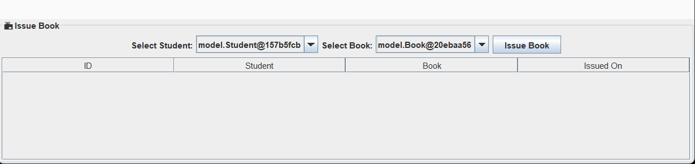

### 📚 Library Management System

A desktop-based Library Management System built using **Java Swing** and **MySQL**, designed to manage books, students, and lending operations. It features a modern UI, admin controls, statistics tracking, and database connectivity using JDBC.

---

### 🚀 Features

* ✅ **Login / Registration** with role-based access (Admin / User)
* 📚 Add, search, issue, and return books
* 👤 Manage student accounts and users
* 📊 View usage statistics
* 🛠 Admin panel for user management (promote, delete)
* 🖥 Responsive dashboard layout with icons
* 🔐 Secure DB interaction using **JDBC + MySQL**

---

### 📸 Screenshots

> 
> 
> 
> 
> 

---

### 🛠 Technologies Used

* Java 17+
* Swing GUI
* MySQL 8+
* JDBC (mysql-connector-j-9.3.0.jar)

---

### 📁 Project Structure

```
📦 library-management
 ┣ 📂 dao              → Data access layer (UserDAO, BookDAO, etc.)
 ┣ 📂 db               → DB connection class
 ┣ 📂 model            → User & Book model classes
 ┣ 📂 ui               → GUI Panels (LoginScreen, DashboardUI, etc.)
 ┣ 📂 lib              → JDBC JAR (mysql-connector-j-9.3.0.jar)
 ┣ 📄 Main.java        → Application entry point
 ┣ 📄 schema.sql       → MySQL table schema
 ┗ 📄 README.md        → This file
```

---

### 🧑‍💻 How to Run

1. **Start MySQL** and create the DB from `schema.sql`:

   ```sql
   CREATE DATABASE library_db;
   USE library_db;
   -- Then run the table creation script
   ```

2. **Compile:**

   ```bash
   javac -cp ".;lib/mysql-connector-j-9.3.0.jar" -d . (Get-ChildItem -Recurse -Filter *.java | ForEach-Object { $_.FullName })
   ```

3. **Run:**

   ```bash
   java -cp ".;lib/mysql-connector-j-9.3.0.jar" Main
   ```

---

### 🗃️ Sample Table Schema (`schema.sql`)

```sql
CREATE TABLE users (
  id INT AUTO_INCREMENT PRIMARY KEY,
  username VARCHAR(50) UNIQUE,
  password VARCHAR(255),
  role VARCHAR(20) DEFAULT 'user'
);

CREATE TABLE students (
  id INT AUTO_INCREMENT PRIMARY KEY,
  name VARCHAR(100),
  email VARCHAR(100),
  department VARCHAR(100)
);

CREATE TABLE books (
  id INT AUTO_INCREMENT PRIMARY KEY,
  title VARCHAR(255),
  author VARCHAR(255),
  quantity INT DEFAULT 1
);

CREATE TABLE issues (
  id INT AUTO_INCREMENT PRIMARY KEY,
  book_id INT,
  student_id INT,
  issue_date DATE,
  return_date DATE,
  returned BOOLEAN DEFAULT FALSE,
  FOREIGN KEY (book_id) REFERENCES books(id),
  FOREIGN KEY (student_id) REFERENCES students(id)
);
```
---

### 🤝 Credits

Developed by **Devansh Singla** as a Java desktop application project.

---